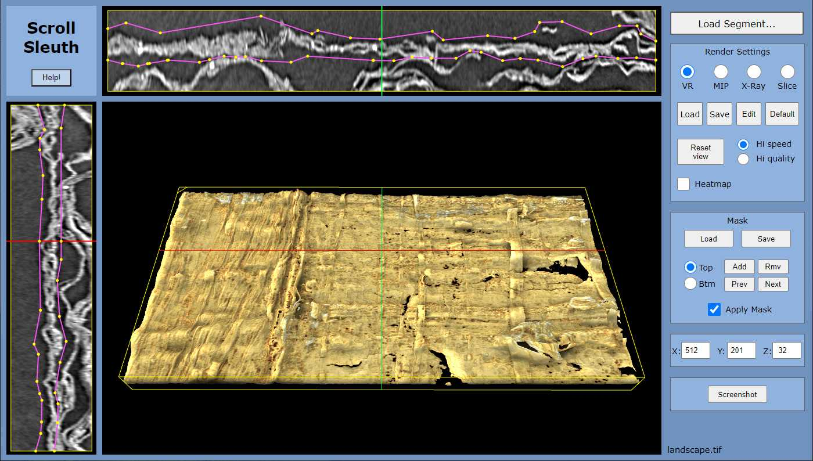
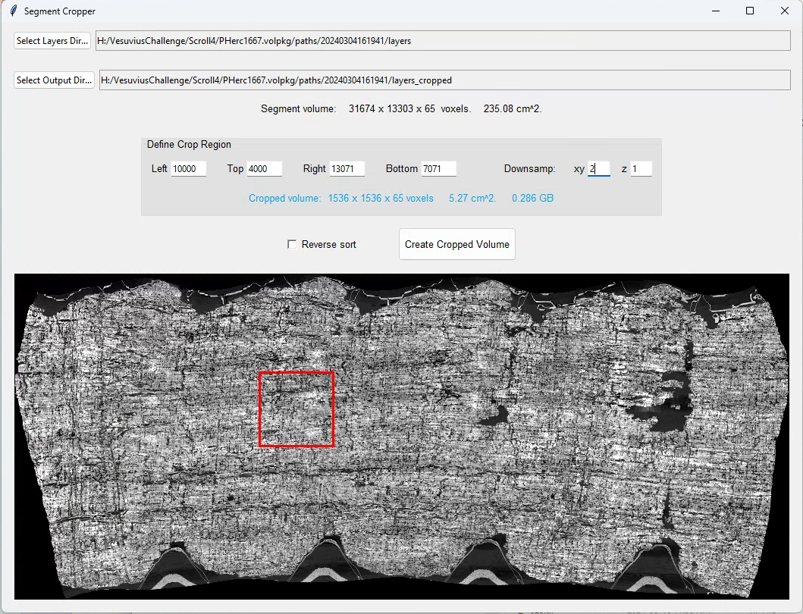
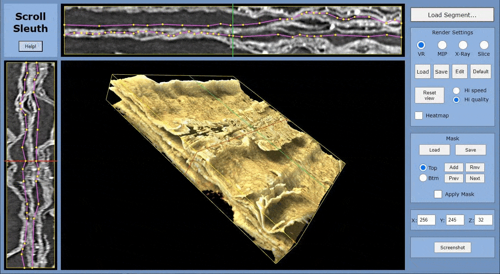

# Scroll Sleuth

Scroll Sleuth is a web app that helps users search for ink in CT scans of ancient Herculaneum scrolls that have been acquired for the [Vesuvius Challenge](https://scrollprize.org/) project.
 

[Click here](https://paul-g2.github.io/ScrollSleuth/) to try it out now, or continue reading below for more information.
 

 

Main features:

- Aids ink-searching by

  - displaying x-ray images that are sensitive to density differences between ink and papyrus,
  - displaying volume-rendered images that can accentuate the shape and texture of thicker ink deposits.

- Has a built-in masking tool for isolating single papyrus layers.
- Requires no installation; it runs in a web browser on any computer with a GPU.
  

Some of these features are similar to, or inspired by, several great projects created by the Vesuvius Challenge community. In particular, you may want to check out: 
[&Omega;mit](https://onedrive.live.com/?authkey=%21ALfVTOHQOkbecQ0&id=D6F698278C30CB3E%212310&cid=D6F698278C30CB3E), 
[Scroll Viewer](https://github.com/lukeboi/scroll-viewer),
[visual-volume](https://github.com/pocper1/visual-volume),
and [khartes](https://github.com/KhartesViewer/khartes).
   

### Quick Start

For a very quick start, you can [launch the app](https://paul-g2.github.io/ScrollSleuth/) and click its "Help" button to load an artificial data set that will let you explore the basic functionality.
     

### Viewing Scroll Segments

Once you have a data set loaded (see "Preparing Scroll Segments" below), you can:

- Rotate the main image with the left mouse button.

- Move it with the right mouse button.

- Zoom with the mouse wheel, or by shift-left dragging.

- Adjust brightness and contrast in any viewport by alt-left dragging.

- Move the (red, green, and blue) cross-reference lines by ctrl-left dragging.

- Change the rendering mode in the right-hand control panel, to one of
  - VR : Volume Rendering
  - MIP : Maximum Intensity Projection
  - X-Ray : Transmission X-ray
  - Slice : Axial cross-section

- Use the *Heatmap* checkbox to apply a color map to the monochrome modes (MIP, X-Ray, and Slice). The color map responds when you change the brightness and contrast.

- Change to the *Hi quality* setting if the dataset is small and mouse interaction is not sluggish. Otherwise use the *Hi speed* setting, which improves performance by rendering a lower-quality image during mouse interaction.

- Click the *Edit* button to bring up the *VR Settings* dialog. This provides full control over the volume rendering settings, including lighting, shading, and the opacity curve (which maps the grayscale pixel values to color and opacity values).  
Once you find settings that you like, you can *Save* and *Load* them as text files on your local machine. Click the "Default" button at any time to revert to the default settings.
    

### Preparing Scroll Segments

Scroll images can be downloaded from the [Vesuvius Challenge data server](https://dl.ash2txt.org/), after you fill out a [registration form](https://scrollprize.org/data). 

Scroll Sleuth works mainly with *segments*, which are portions of a full scroll volume that have been virtually carved out and flattened. These are located in the *layers* subdirectories on the server, for example [https://dl.ash2txt.org/full-scrolls/Scroll4/PHerc1667.volpkg/paths/20240304161941/layers.](https://dl.ash2txt.org/full-scrolls/Scroll4/PHerc1667.volpkg/paths/20240304161941/layers)  

In most cases, the segments are too large to fit into graphics memory, so they need to be cropped and/or down-sampled with the *Segment Cropper* tool:

 

To use Segment Cropper,

- Copy or clone the *cropper* folder from this repository.

- Install the dependencies: `pip install -r requirements.txt`

- Start Segment Cropper: `python cropper.py`

- Select a *layers* directory, and wait a few seconds for the thumbnail image to appear.

- Select an output directory.

- Specify the crop region, and optional down-sampling factors.

- Click "Create Cropped Volume." The cropped volume images that appear in the output directory can then be loaded into Scroll Sleuth. 

A crop size of 1024 x 1024 is probably reasonable for most machines. It can be several times larger if you have a good GPU with lots of video memory. If you see sluggish performance, or you get "context-lost" errors, try a smaller crop size. 

    

### Working with Masks

One of the main features of Scroll Sleuth is its support for creating *masks* to isolate single papyrus layers. The following image shows a segment before and after a mask is applied to isolate the central layer. 

- Masks are created by drawing horizontal "ridges" that follow the papyrus surface. 

- Click the "Add" button to create a ridge at the current y-location (y is the vertical direction). It will be visible in the upper viewport as a purple line with yellow control points, overlaid on a cross-section of the papyrus. 

- Then edit the ridge by dragging the yellow control points.

- Add or remove control points by right-clicking.

- At y-locations where no ridge has been created, the mask surface will be interpolated and drawn as a purple line without control points.  

- The mask surface is drawn in the side viewport as well, and you can also move the control points there. (But they can only be added or removed in the upper viewport.)

  - Note that the papyrus thickness is not drawn to scale in the upper and side viewports; it is stretched to make drawing the ridges easier.

- Masks can be saved and loaded with the "Save" and "Load" buttons in the mask-controls panel. 

